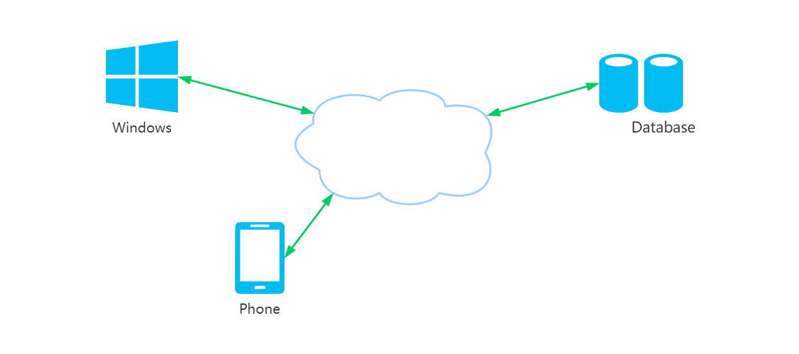
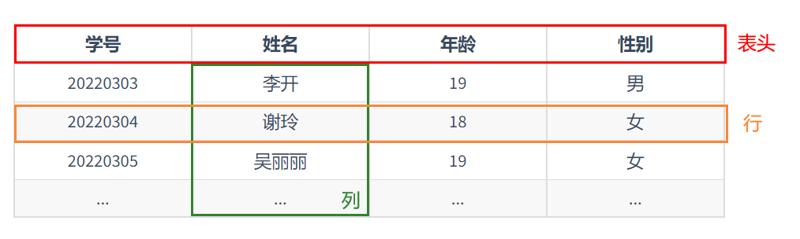

# 认识MySQL

MySQL是一个**关系型数据库管理系统**，由瑞典MySQLAB公司开发，属于 Oracle 旗下产品。MySQL 是最流行的关系型数据库管理系统之一，在 WEB应用方面，MySQL 是最好的 RDBMS（Relational Database Management System，关系数据库管理系统）应用软件之一。

 

### 1、什么是数据库

粮仓是存放粮食的容器。同样数据库就是用来存放数据的容器。正是因为有了数据库后，我们可以直接查找数据。例如你每天使用余额宝查看自己的账户收益，就是从数据库读取数据后给你的。

数据库是一个以某种有组织的方式存储的数据集合

 

### 2、数据库类型

数据库共有2种类型：**关系型数据库**、**非关系型数据库** 。

#### 关系型数据库

MySQL、MariaDB、SQLite、Oracle、SQL Server、Sybase、Microsoft Access、Google Fusion Tables、DB2等。

关系型数据库最典型的数据结构是表，由二维表及其之间的联系所组成的一个数据组织

**优点：**

1、易于维护：都是使用表结构，格式一致

2、使用方便：SQL语言通用，可用于复杂查询

3、复杂操作：支持SQL，可用于一个表以及多个表之间非常复杂的查询

**缺点：**

1、读写性能比较差，尤其是海量数据的高效率读写

2、固定的表结构，灵活度稍欠

3、高并发读写需求，传统关系型数据库来说，硬盘I/O是一个很大的瓶颈

 

#### 非关系型数据库

MongoDB、redis、Memcache、HBase、BigTable、Cassandra、CouchDB、Neo4J。

非关系型数据库严格上不是一种数据库，应该是一种数据结构化存储方法的集合，可以是文档或者键值对等。

**优点：**

1、格式灵活：存储数据的格式可以是key-value形式、文档形式、图片形式等等，文档形式、图片形式等等，使用灵活，应用场景广泛，而关系型数据库则只支持基础类型。

2、速度快：NoSQL可以使用硬盘或者随机存储器作为载体，而关系型数据库只能使用硬盘

3、高扩展性

4、成本低：nosql数据库部署简单，基本都是开源软件

**缺点：**

1、不提供sql支持，学习和使用成本较高

2、无事务处理

3、数据结构相对复杂，复杂查询方面稍欠

 

### 3、什么是关系型数据库

数据库有很多种类，其中关系型数据库最受欢迎的数据库系统之一。

关系型数据库是由多个表组成的。如果你用过Excel，就会知道Excel是一张一张的二维表。每个表都是由行和列组成的。同样的，关系数据库里存放的也是一张一张的表，只不过各个表之间是有联系的。

> <h5>关系型数据库 = 多张表 + 表之间的关系</h5>
>

 

表（table）：某种特定类型数据的结构化清单。（表是一种结构化的文件，可用来存储某种特定类型的数据）

列（column） ：列中存储着表中某部分的信息。所有表都是由一个或多个列组成的表由列组成

行（row）：表中的一个记录。

主键（primary key）：唯一标识表中每行的这个列（或这组列）称为主键

外键：外键用于关联两个表。

索引：使用索引可快速访问数据库表中的特定信息。

 

 

### 4、什么是MySQL

MySQL 是最受欢迎的开源 SQL 数据库管理系统，由 Oracle Corporation 开发、分发和支持。MySQL 网站 ( http://www.mysql.com/ ) 提供有关 MySQL 软件的最新信息。

1、MySQL 是一个数据库管理系统

2、MySQL 数据库是关系型的。

3、MySQL 软件是开源的。

4、MySQL 数据库服务器非常快速、可靠、可扩展且易于使用。

5、MySQL 服务器可工作在客户端/服务器或嵌入式系统中。

6、有大量的软件使用了MySQL

 

#### 2、MySQL的主要特点

1、内部结构和便携性

2、多种数据类型

3、完整运算符和函数支持

4、权限和密码安全

5、支持大型数据库，扩展性强

6、支持多种协议连接到 MySQL 服务器

7、支持多种语言向客户端提供错误消息

8、客户端和工具

 

### 参考文献

MySQL文档-教程：https://dev.mysql.com/doc/refman/5.7/en/tutorial.html